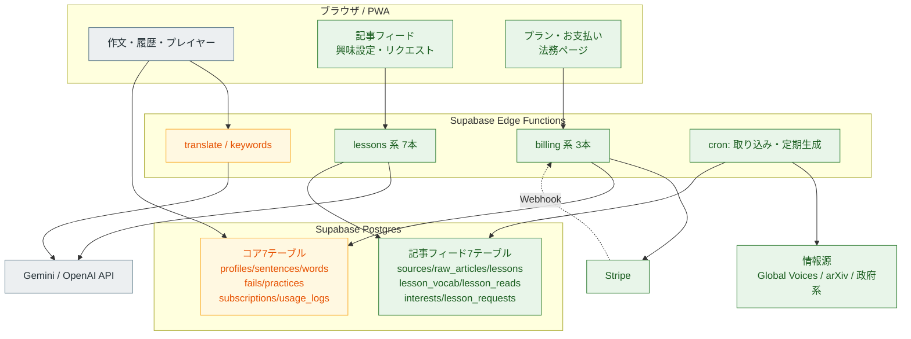
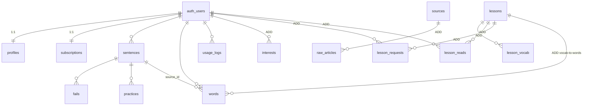
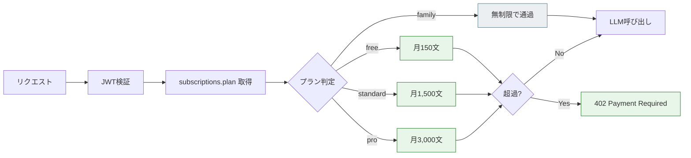
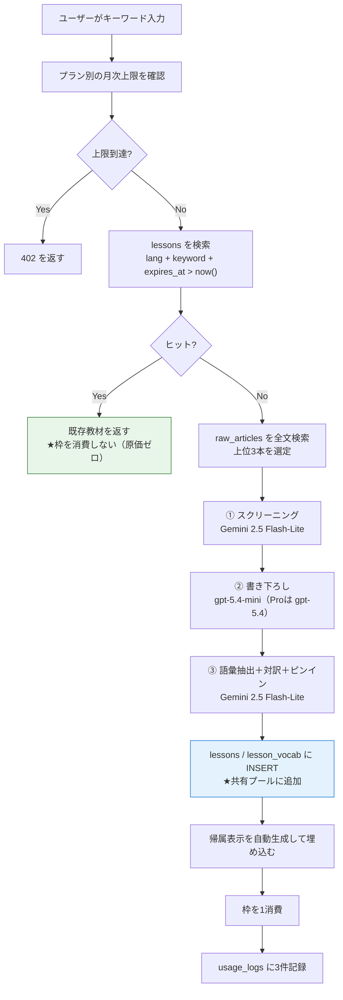
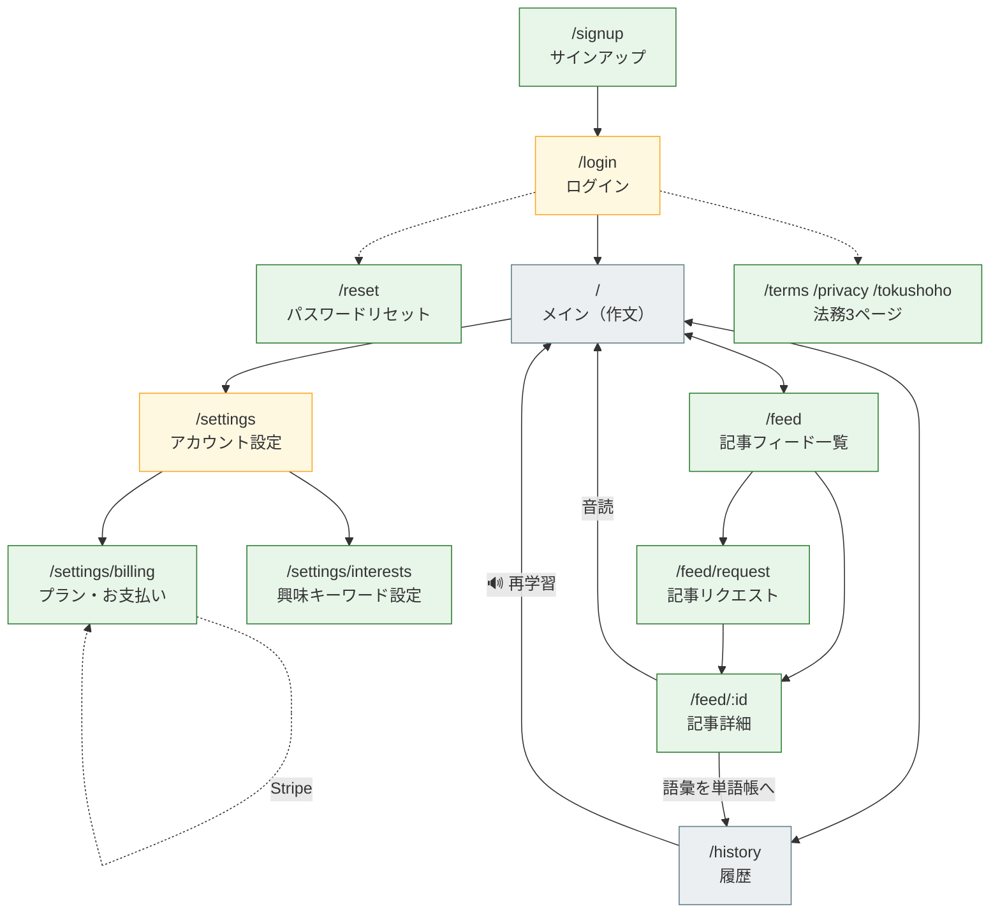
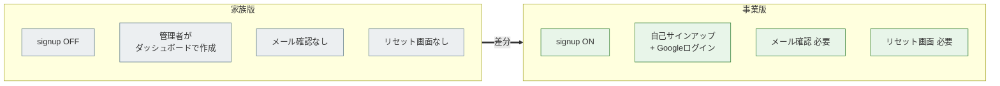
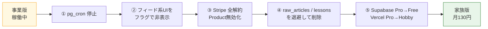

# 事業版[[差分仕様書]]

作成日: 2026-07-26 / ベースライン: `family-edition-spec.md`
対象: 家族版から**有料SaaS版へ拡張する差分のみ**

> **本書は差分のみを記述する。** 家族版と同一の部分は書かない。
> 「家族版 + 本書 = 事業版の完全な仕様」となるように構成している。
> 記述の形式は **追加 / 変更 / 削除** の3種類。

---

## 1. 全体像

### 1.1 アーキテクチャの差分



**凡例**： ⬜ 家族版のまま　🟩 **追加**　🟨 **変更**

### 1.2 差分の総量

> **基数（家族版の値）は `family-edition-spec.md` の実装済みの姿。** 片方だけ更新するとズレるため、
> 家族版を改訂したらこの表を必ず引き直すこと。

| 領域 | 家族版 | 追加 | 変更 | 削除 |
|---|---|---|---|---|
| テーブル | 8 | **+7** | 2 | 0 |
| RLSポリシー | 8 | **+3** | 0 | **0** |
| Edge Function | 3 | **+12** | 3 | 0 |
| 画面（ルート） | 6 | **+5** | 2 | 0 |
| 外部依存 | 2 | **+3** | 0 | 0 |

- **家族版の内訳**：テーブル8（profiles/sentences/words/fails/practices/subscriptions/usage_logs/**assessments**）、Edge Function 3（translate/keywords/**assess**）、画面6（`/` `/history` `/record` `/settings` `/login` ＋プレイヤー）、外部依存2（**Gemini・Azure Speech**）
- **RLS**：`lessons` 系はポリシーを作らない（§8.1）。追加は `lesson_reads` / `interests` / `lesson_requests` の3本のみ。家族版の `family read` は既に廃止済みで、**削除作業は不要になった**
- **外部依存の追加3**：Stripe / 情報源API / **OpenAI**（§3.3 の書き下ろし）
- **画面**：独立ルートは5つ（記事フィード一覧・記事詳細・サインアップ・パスワードリセット・法務）。記事リクエスト／プラン・お支払い／退会は**既存画面のセクション**として実装する（§4.2）

---

## 2. データベースの差分

### 2.1 ER図（コア＋追加分）



> **`lessons` は `user_id` を持たない。** 全ユーザーの共有プールであることがこの設計の要。

### 2.2 追加テーブル（7本）

定義の全文は `../30-research/saas-migration-study.md` §5.1b を参照。役割の要約：

| テーブル | 役割 | `user_id` |
|---|---|---|
| `sources` | 事前選定した情報源。**ライセンス・帰属テンプレ・利用可能範囲を保持** | なし（管理者データ） |
| `raw_articles` | 取り込んだ生記事。**ユーザーには直接見せない**（事実抽出のネタ元） | なし |
| `lessons` | **生成された学習教材。共有プールの本体** | なし（★重要） |
| `lesson_vocab` | 教材の重要語彙 | なし |
| `lesson_reads` | 誰がどの教材を読んだか | **あり** |
| `interests` | ユーザーの興味キーワード | **あり** |
| `lesson_requests` | リクエスト履歴。**プラン上限のカウント対象** | **あり** |

### 2.3 変更テーブル（2本）

#### `subscriptions` — 課金連携のためのカラム追加と値域変更

```sql
-- 【変更】plan の値域
--   家族版: 'family' 固定
--   事業版: 'family' | 'free' | 'standard' | 'pro'
--   ★ 'family' を必ず残すこと。落とすと家族3人の既存行がCHECK制約に違反する
-- 【追加】Stripe連携カラム
alter table subscriptions
  add column stripe_customer_id     text unique,
  add column stripe_subscription_id text unique,
  add column current_period_end     timestamptz;

-- 【変更】status の値域
--   家族版: 'active' 固定
--   事業版: 'active' | 'trialing' | 'past_due' | 'canceled' | 'inactive'
```

> **既存の家族3人は `plan='family'` のまま残す**（無料で全機能が使える内部ユーザーとして扱う）。値域に `'family'` を含めたまま拡張する。

#### `usage_logs` — 記事生成系の記録に対応

```sql
-- 【変更】kind の値域に3種を追加
--   家族版: 'translate' | 'keywords' | 'assess'
--   事業版: + 'screening' | 'lesson_write' | 'lesson_vocab'
-- 【追加】記事生成時の対象を記録
alter table usage_logs add column lesson_id uuid;
-- user_id は家族版で既に nullable（追加作業なし）
```

### 2.4 削除するRLSポリシー — **解消済み**

かつて家族版に、家族間で最終利用日を共有するための全開放ポリシー
（`create policy "family read" on profiles for select using (true);`）があり、
本書は「事業版で消し忘れると全ユーザーのプロフィールが他人から見える」**最重要の見落とし**として警告していた。

**2026-07-26、家族版の側でこの機能ごと廃止した**ため、事業版での削除作業は不要になった。

| 廃止の理由 | |
|---|---|
| ① | 評価に必要な利用状況は `practices` テーブルからSQLで取れる（`../00-business/exit-plan.md` §6） |
| ② | 公開URL運用では anon キー保持者に全プロフィールが読める |
| ③ | **必要のない機能のために、事業版で削除必須の負債を先に作ることになっていた** |

> **復活させないこと。** 家族版の `20260726000001_init.sql` にも同趣旨の注記がある。

### 2.5 追加するRLSポリシー

```sql
-- 管理者専用（サービスロールのみ）
alter table sources      enable row level security;
alter table raw_articles enable row level security;
-- ポリシーを作らない = anon/authenticated からは一切アクセス不可

-- 教材は Edge Function 経由でのみ配信するため、直接SELECTは禁止
alter table lessons      enable row level security;
alter table lesson_vocab enable row level security;
-- ポリシーを作らない

-- 本人のみ
alter table lesson_reads     enable row level security;
alter table interests        enable row level security;
alter table lesson_requests  enable row level security;

create policy "own rows" on lesson_reads for all
  using (auth.uid() = user_id) with check (auth.uid() = user_id);
create policy "own rows" on interests for all
  using (auth.uid() = user_id) with check (auth.uid() = user_id);
create policy "own read" on lesson_requests for select
  using (auth.uid() = user_id);
```

> **`lessons` にポリシーを作らない**のが肝。Supabase SDK から直接引けないため、Free/有料の出し分けを Edge Function で強制できる。

---

## 3. API の差分

### 3.1 追加エンドポイント（12本）

| メソッド / パス | 用途 | 認証 |
|---|---|---|
| `GET /lessons` | 記事フィード一覧。プラン判定＋Freeは月3本でゲート | 必要 |
| `GET /lessons/:id` | 記事詳細。本文・対訳・語彙・**出典リンク・帰属表示** | 必要 |
| `POST /lessons/request` | キーワード指定の生成。キャッシュ判定→枠消費→生成 | 必要 |
| `GET /lessons/quota` | 当月のリクエスト残数・作文残文数 | 必要 |
| `POST /lessons/:id/read` | 既読記録 | 必要 |
| `POST /lessons/:id/vocab-to-words` | 抽出語彙を自分の単語帳へ登録 | 必要 |
| `POST /lessons/:id/proofread` | 記事の語彙を使った自作文のAI添削（Pro） | 必要 |
| `POST /billing/checkout` | Stripe Checkout セッション作成 | 必要 |
| `POST /billing/portal` | Stripe カスタマーポータルURL発行 | 必要 |
| `POST /stripe-webhook` | **署名検証必須。冪等性処理必須** | 署名 |
| 内部 `cron_ingest_sources()` | 情報源からの記事取り込み（pg_cron 日次） | — |
| 内部 `cron_generate_daily()` | 人気カテゴリの定期生成（pg_cron 日次） | — |

`interests` のCRUDは Supabase SDK 直叩き（RLSで本人のみ）。

### 3.2 変更エンドポイント（3本）

#### `/translate` `/keywords` — クォータ判定を有効化

家族版では**判定コードパスを通すだけで素通し**していた箇所を、実際に効かせる。



**判定を呼ぶ場所は家族版で実装済み**だが、中身は**空である**。家族版の `checkQuota()` は
`subscriptions` を引くだけで両分岐とも `allowed: true` を返す。事業版で追加が必要なのは3つ。

1. **`usage_logs` からの当月件数の集計**（`kind` 別・`created_at` が当月）
2. **プラン別の上限値**（上図）
3. **`status` による停止判定**（`past_due` / `canceled` の扱い。現在は取得のみで未使用）

#### `/assess` — 発音評価に月次上限を追加（★家族版には上限が無い）

**Azure Speech は従量課金**（音声の長さで課金）。家族版は `family` プランで無制限に通しているが、
**事業版で無制限のまま公開すると原価が青天井になる。**

| プラン | 発音評価の月次上限 | 備考 |
|---|---|---|
| free | **要決定** | 味見程度に絞る |
| standard | **要決定** | 主たる利用者層 |
| pro | **要決定** | — |

> **上限値は未決。** `../00-business/pricing-plan.md` §5 のプラン表にも発音評価の行が無く、
> §6 のユニットエコノミクスにも Azure の原価が計上されていない。
> **家族版の2ヶ月の評価期間で「1人あたり月何回・何秒使うか」を実測してから決める。**

**あわせて必要な改修:**

- `usage_logs` は Gemini のトークン数を前提にした列構成のため、**Azure の課金単位（音声の秒数）を記録できない**。`audio_seconds` 列を追加し、`logUsage()` に `model` を渡せるようにする（現状 `kind='assess'` の行も `model='gemini-...'`・トークン0 で記録される）
- **この改修は家族版の評価期間より前に入れないと、原価の実測データが取れない**（`../20-plans/family-evaluation-plan.md` の集計SQLはトークン数しか見ていない）

### 3.3 記事リクエストのフロー（新規）

**共有プールの肝。キャッシュヒット時は枠を消費しない。**



---

## 4. 画面の差分

### 4.1 画面遷移図（追加分をハイライト）



### 4.2 追加画面（11）

| 画面 | 内容 | 必須度 |
|---|---|---|
| サインアップ | メール/パスワード + Googleログイン | 必須 |
| パスワードリセット | Supabase Auth 標準機能 | 必須 |
| **記事フィード一覧** | 新着／カテゴリ別／既読・未読。Freeは月3本でゲート | 必須 |
| **記事詳細** | 本文・日本語対訳・ピンイン・重要語彙。**出典リンクと帰属表示は法的に必須** | 必須 |
| **記事リクエスト** | キーワード入力。残数表示＋「既にあれば消費しない」旨の提示 | 必須 |
| 興味キーワード設定 | `interests` の登録・削除 | **後回し**（定期生成とセット。§10） |
| プラン・お支払い | 現在のプラン、当月使用量、アップグレード、Stripeポータル導線 | 必須（**設定画面のセクション**。中身は実質 Stripe ポータルへの導線） |
| 退会 | 全データ削除の確認 | 必須（**設定画面のセクション**） |
| 利用規約 / プライバシーポリシー / 特商法表記 | 静的3ページ | **法的に必須** |
| アーカイブ | 鮮度切れの教材を別表示 | 後回し |
| ~~連載ビュー~~ | ~~同一トピックの深掘り（Pro）~~ | **作らない**（§10） |

### 4.3 変更画面（2）

#### ログイン画面

| | 家族版 | 事業版 |
|---|---|---|
| サインアップ導線 | **なし**（signup無効） | **あり** |
| パスワードリセット導線 | なし | **あり** |
| Googleログイン | なし | **後回し**（§10） |
| 法務ページへのリンク | なし | **あり** |

#### アカウント設定画面

| 項目 | 家族版 | 事業版 |
|---|---|---|
| 表示名 / 既定言語 / 発音速度 / 区切りモード | ○ | ○ |
| ~~家族の最終利用日~~ | **廃止済み**（家族版で削除） | — |
| エクスポート / ログアウト | ○ | ○ |
| プラン・使用量 | — | **追加** |
| 興味キーワード | — | 後回し（§10） |
| 退会 | — | **追加** |

---

## 5. 認証の差分



| 項目 | 家族版 | 事業版 | 作業 |
|---|---|---|---|
| Email signup | **OFF** | **ON** | ダッシュボード設定 |
| メール確認 | 不要 | **必要** | **カスタムSMTP設定が必要**（Supabase内蔵SMTPは送信数制限あり） |
| パスワードリセット | 画面なし | **画面を実装** | 追加 |
| ソーシャルログイン | なし | **Google / Apple** | 追加 |
| 新規登録時の初期化 | トリガーで `profiles` + `subscriptions(plan='family')` | 同トリガーで **`plan='free'`** | **変更** |

> **カスタムSMTPの設定を忘れると、サインアップ直後にメールが届かず登録が完了しない。** 事業版で最初につまずくポイント。

---

## 6. インフラ・運用の差分

| 項目 | 家族版 | 事業版 | 備考 |
|---|---|---|---|
| Supabase | **Free** | **Pro（$25/月）** | `raw_articles` を作った時点で500MB上限を超える。**記事フィード着手＝Pro移行** |
| ホスティング | **Vercel Hobby（無料）** | **Vercel Pro（$20/月）** | **Hobbyは非商用限定。課金開始前に必ず移行** |
| ドメイン | `*.vercel.app` | **独自ドメイン** | 特商法表記の信頼性にも影響 |
| pg_cron | 未使用 | **有効化** | 記事取り込みと定期生成 |
| keepalive | GitHub Actions 週1回 | **不要**（Proは停止しない） | 削除してよい |
| バックアップ | なし | **日次・7日保持**（Pro標準） | |
| エラー監視 | なし | **Sentry等** | |
| レート制限 | なし | **必要** | 翻訳・記事リクエストの乱用防止 |
| スクレイピング | なし | **不要の見込み** | 推奨情報源はすべてRSS／公式API |

---

## 7. 撤退時の逆操作（差分の巻き戻し）

**本書の差分は、そのまま撤退手順の裏返しになる。**



**テーブルを DROP する必要はない。** cron を止めれば `raw_articles` は増えず、UIを隠せば `lessons` は参照されない。Free枠の500MBに収めるためにデータを退避・削除するだけでよい。

所要時間は半日程度（`../00-business/exit-plan.md` §4.1）。

**注意**：`"family read"` ポリシーは家族版で廃止済み（§2.4）。撤退時に復活させる必要はない。

---

## 8. 差分の索引（実装時のチェックリスト）

### 8.1 追加

- [ ] テーブル7本（`sources` `raw_articles` `lessons` `lesson_vocab` `lesson_reads` `interests` `lesson_requests`）
- [ ] RLSポリシー（本人のみ3本。`lessons` 系は**ポリシーを作らない**）
- [ ] Edge Function 12本（§3.1）
- [ ] 画面11（§4.2）
- [ ] Stripe 連携（Product / Price / Checkout / Portal / Webhook）
- [ ] 情報源の取り込みバッチと定期生成（pg_cron）
- [ ] 帰属表示の自動生成（`sources.attribution_template` から）
- [ ] レート制限
- [ ] カスタムSMTP

### 8.2 変更

- [ ] `subscriptions`：Stripeカラム追加、`plan`/`status` の値域拡張
- [ ] `usage_logs`：`kind` に3種追加、`lesson_id` 追加、`user_id` を nullable に
- [ ] `/translate` `/keywords`：クォータ判定を実際に効かせる
- [ ] 新規登録トリガー：`plan='family'` → `plan='free'`
- [ ] ログイン画面：サインアップ・リセット・Googleログインの導線を追加
- [ ] アカウント設定：プラン欄・興味キーワード・退会を追加
- [ ] Supabase Free→Pro、Vercel Hobby→Pro

### 8.3 削除

- （`"family read"` RLSポリシーと「家族の最終利用日」欄は**家族版で廃止済み**。作業なし。§2.4）
- [ ] GitHub Actions の keepalive

---

## 9. 差分を壊さないための原則

1. **依存は「フィード → コア」の一方向に限定する。** `sentences` 等のコアテーブルが `lessons` を参照してはいけない（`words` に記事由来の語彙を入れるのはOK。`source_id` は `sentences` を指すため）
2. **`lessons` に `user_id` を持たせない。** 共有プールの前提が崩れ、原価構造が壊れる
3. **教材の配信は必ず Edge Function 経由。** `lessons` にRLSポリシーを作らないことで構造的に強制する
4. **家族3人は `plan='family'` のまま残す。** 有料プランの検証時に自分が課金対象になると面倒
5. **帰属表示は自動生成に限る。** 人手のチェックリストに頼るとライセンス違反が必ず起きる

---

## 10. 初期リリースに含めないもの（2026-07-26 決定）

**個人開発で使える時間は限られる。差分の全量を最初から作らない。**
以下は「作らない」ではなく「**最初のリリースには入れない**」。値域やテーブルは拡張できる形で残す。

### 10.1 Pro プランを最初は出さない ★

**初期は Standard 単一プランで公開する。**

| 根拠 | 出典 |
|---|---|
| Pro を用意しても**損益分岐点は10人→9人と1人しか変わらない** | `../00-business/pricing-plan.md` §7 |
| 記事原価が3倍になっても**利益への影響は数%**＝上位モデルは訴求として弱い | `../00-business/revenue-forecast.md` §4 |
| 基本ケースの12ヶ月時点で会員30人。Pro が2割なら**6人**のために専用機能を作ることになる | 同 §3 |
| プランが単純なほど**サポート負荷が最小**になる | `../00-business/pricing-plan.md` §9 案D |

| Pro 専用とされていた機能 | 扱い |
|---|---|
| 難易度レベル指定 / 長さ指定 | **Standard に含める**。書き下ろし型への改修の副産物で、追加コストがほぼない（`../00-business/pricing-plan.md` §10.2） |
| 上位モデル | 環境変数の分岐のみ。Pro を出すときに有効化 |
| 深掘り（同一トピックの連載生成）＋連載ビュー | **作らない**。別パイプライン＋専用画面が要るわりに需要が不明 |
| 記事のAI添削（`/lessons/:id/proofread`） | **作らない**。Pro の定義（`../00-business/pricing-plan.md` §0）にも入っておらず、位置づけが定まっていない |
| サポート優先対応 | **約束しない**。個人開発でSLAを負うのは `../00-business/exit-plan.md` §3.4 と矛盾する |

`subscriptions.plan` の値域には `'pro'` を**残す**（後から出せるようにするため。書くだけでコストゼロ）。

### 10.2 後回しにするもの

| 項目 | 理由 | 入れる時期の目安 |
|---|---|---|
| **人気カテゴリの定期生成**（`cron_generate_daily` / `interests` / 興味設定画面） | 会員10人時点の想定ヒット率は20%＝**生成した8割が読まれない**。固定費 月1,046円は貢献利益1人分を超える | 会員30人を超えてから |
| **Google / Apple ログイン** | 効くのは登録摩擦であって転換率ではない。転換率が最大の感度（`../00-business/revenue-forecast.md` §4）。Apple は年約15,000円の開発者登録も要る | 転換率の改善に着手するとき |
| **エラー監視SaaS・レート制限** | 会員10〜30人ならEdge Functionの標準ログで足りる。乱用対策はプラン別クォータが果たす | 障害が実際に見えなくなったら |
| **既読記録**（`lesson_reads` / `POST /lessons/:id/read`） | 記事が数十本の段階で価値がない。コアと疎結合なので後付けが容易 | 記事が増えてから |
| **アーカイブ画面** | 本書自身が必須度「推奨」としていた | 鮮度切れが問題になってから |

### 10.3 独立ページにしないもの

**画面は「ルート」ではなく「セクション」で数える。** 独立ルートが要るのは5つだけ。

| セクションに畳むもの | 畳み先 |
|---|---|
| 記事リクエスト | 記事フィード一覧の上部（入力欄1つ） |
| プラン・お支払い | アカウント設定（中身は実質 Stripe ポータルへの導線） |
| 退会 | アカウント設定（確認1回） |

### 10.4 判断を保留するもの

| 項目 | 保留の理由 |
|---|---|
| **`raw_articles` の常時蓄積** | 作った時点で Supabase Pro（月3,750円）が確定する（§6）。一方 `../00-business/exit-plan.md` §3.5 は「Pro 切替は公開の直前」と言っており**両立しない**。初期はリクエスト時に情報源を都度引く簡易版にできないか、GO判断時に再検討する |
| **発音評価のプラン別上限** | 家族版の評価期間で実測してから決める（§3.2） |
| **年払い** | `../00-business/exit-plan.md` §3.1・`../20-plans/execution-plan.md` §5 より、**Stripe の Price は当面 月額のみ作成**する（撤退時に残期間の返金債務を抱えないため） |

---

### 関連ドキュメント

- `family-edition-spec.md` — **ベースライン（本書と対で使う）**
- `current-app-spec.md` — 現行機能の移植チェックリスト
- `../30-research/saas-migration-study.md` — 事業版の背景・意思決定・法務要件
- `../00-business/pricing-plan.md` — 料金プラン・原価計算
- `../30-research/content-sources.md` — 情報源の評価（**ライセンスの正典**）
- `../00-business/exit-plan.md` — 撤退ラインと退避先
