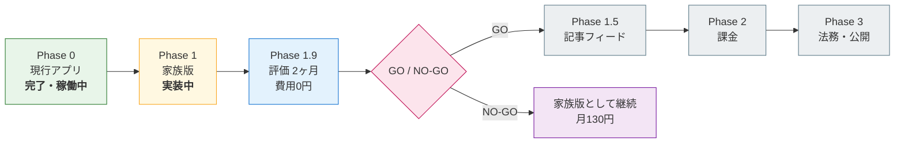

# 実行計画

作成日: 2026-07-26 / 現在地: **Phase 1 実装中（コード実装済み・環境構築が未着手）**

> 何を・どの順で作るかの計画。**仕様は `../10-specs/` を、判断基準は `../00-business/` を参照。**

---

## 1. 全体の流れ

| Phase | 内容 | 期間 | 費用 |
|---|---|---|---|
| 0 | 現行アプリ（Mac常駐） | 完了 | 0円 |
| **1** | **家族版（Supabase + PWA）** | **約1ヶ月** | **0円** |
| 1.9 | 評価期間 | 2ヶ月 | 0円 |
| 1.5 | 記事フィード | 2ヶ月 | 数百円/月 |
| 2 | 課金（Stripe） | 1ヶ月 | 〃 |
| 3 | 法務・公開 | 2週間 | ドメイン代 |

**家族版まで約1ヶ月・0円。有料公開まで着手から5〜6ヶ月（うち2ヶ月は評価期間）。**

---

## 2. Phase 1：家族版

仕様は `../10-specs/family-edition-spec.md`。実装は `../../apps/family/`。

### 2.1 コード実装 — **完了**

- [x] DBスキーマ・RLS・トリガー（`supabase/migrations/`）
- [x] Edge Function `translate` / `keywords`（プロンプト移植・入替補正込み）
- [x] Edge Function `assess`（Azure発音評価のプロキシ）
- [x] クライアント（ログイン・ルーティング・作文・履歴・プレイヤー・記録・設定・エクスポート）
- [x] R/V/T/N分類のJS移植（Python版と一致することを検証済み）
- [x] データ移行スクリプト（実データでドライラン検証済み）
- [x] PWA manifest / keepalive

### 2.2 環境構築 — **未着手（要・本人作業）**

| # | 作業 | 所要 |
|---|---|---|
| 1 | Supabase プロジェクト作成（Tokyo / Free） | 10分 |
| 2 | **Email signup を OFF**、家族3人を手動作成 | 10分 |
| 3 | マイグレーション2本を実行 | 5分 |
| 4 | Gemini APIキー取得 → `supabase secrets set` | 10分 |
| 5 | Azureキーを `supabase secrets set`（現行 config.json の値） | 5分 |
| 6 | Edge Function 3本をデプロイ | 10分 |
| 7 | `web/config.js` にURL/anonキーを記入 | 5分 |
| 8 | Vercel へデプロイ | 15分 |
| 9 | データ移行（ドライラン → 本実行） | 15分 |
| 10 | GitHub Actions の keepalive 設定 | 5分 |

手順は `../../apps/family/README.md`。

### 2.3 受け入れ確認

`../10-specs/family-edition-spec.md` §13 の7項目。特に：

- 家族3人が**互いのデータを見られない**（RLSの実地確認）
- iPhoneのホーム画面から起動して発音・保存・履歴・再学習・**発音チェック**が動く
- クライアントのバンドルに**APIキーが含まれていない**

---

## 3. Phase 1.9：評価期間（2ヶ月）

`family-evaluation-plan.md` に詳細。**この期間に実装を進めない**（判断を曇らせるため）。

---

## 4. Phase 1.5 以降（GOの場合のみ）

差分仕様は `../10-specs/saas-diff-spec.md`。

| Phase | 主な作業 | 最大の未知数 |
|---|---|---|
| 1.5 | 情報源からの収集 → **記事の選別** → 書き下ろし → 語彙抽出 | **選別（目利きの自動化）** |
| 2 | Stripe Billing・プラン制限・クォータ判定の有効化 | — |
| 3 | 利用規約・特商法・プライバシーポリシー、弁護士確認 | — |

### 事前に済ませておくべき調査（Phase 1.5 の前）

1. 中国語ソースの方針決定（アーカイブ教材で割り切る / 台湾政府系 / 英語のみ）
2. arXiv で拾うカテゴリの特定（cs.RO に加え cs.AI / cs.LG / cs.CV）
3. 各サイトの robots.txt・利用規約の確認（Global Voices は **Crawl-delay 10秒**）
4. 情報源ごとの実供給量の計測

> **これらは Phase 1.9 の評価期間中に並行して進めてよい**（実装ではなく調査のため）。

---

## 5. 設計上の制約（撤退コストを下げるため）

`../00-business/exit-plan.md` §3 より。**Phase 1 の時点で守る。**

| 制約 | 理由 |
|---|---|
| コア機能と記事フィードを**疎結合**にする | 記事だけ切り離して畳める |
| **最初は年払いを出さない** | 撤退時に残期間の返金債務を抱えない |
| エクスポート機能を必ず持つ | ユーザーの離脱コストを下げ、信頼を得る |
| RLS・`user_id`・`usage_logs`・`subscriptions` は家族版から入れる | 後付けが困難 |

---

### 関連文書

- `status-summary.md` — 検討の経緯と現況
- `family-evaluation-plan.md` — 評価期間の進め方
- `../00-business/go-nogo-plan.md` — 判断基準
- `../10-specs/family-edition-spec.md` — 家族版の仕様
