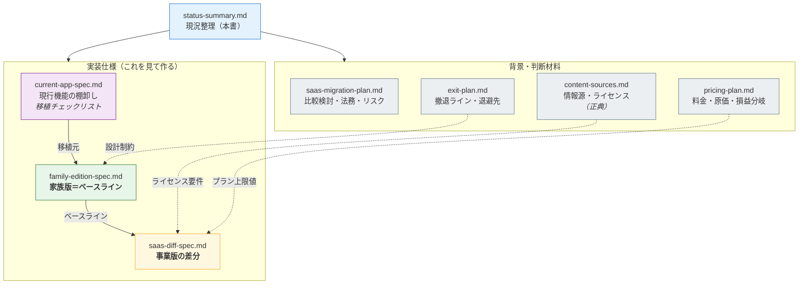

# 現況整理 — [[有料アプリ化]]検討

最終更新: 2026-07-25 / ステータス: **設計検討フェーズ（実装未着手）**

---

## 1. どこまで決まったか

### 1.1 事業モデル

| 項目 | 決定内容 |
|---|---|
| **無料の範囲** | 自分で作文・翻訳・発音・保存・失敗履歴（月150文） |
| **有料の価値** | **興味キーワードから学習教材が自動生成される[[記事フィード]]** |
| 提供形態 | [[PWA]]（Web直販）。ストア配信は後日の集客チャネルとして検討 |
| 対象言語 | 英語＋中国語 |

**この線引きが良い理由**：前案（無料は月30文、有料は上限解除）は「我慢すれば無料で足りる」ため課金理由が弱かった。記事生成は無料では絶対に得られない価値なので、**代替不能な課金理由**になる。

### 1.2 技術構成

| レイヤ | 決定 |
|---|---|
| 認証・DB | **[[Supabase]]**（Auth + Postgres + [[RLS]]） |
| LLM | **クラウドAPI**。書き下ろしは gpt-5.4-mini（**Pro は gpt-5.4**）、選別・語彙は Gemini 2.5 Flash-Lite |
| 課金 | **[[Stripe]]** Billing（実効手数料 4.3%） |
| 音声 | **[[Web Speech API]] のまま**（原価ゼロ。ここは変えない） |
| 記事の生成方式 | **全ユーザー共通の共有プール**（誰かのリクエストで作った教材を全員が読める） |
| 著作権対応 | **[[AI書き下ろし型]]**（要約ではなく、事実を抽出してオリジナル執筆） |

### 1.3 料金プラン

| プラン | 月額 | 年額 | 内容 |
|---|---|---|---|
| Free | 0円 | — | 作文月150文／記事は月3本まで味見 |
| **Standard** | **980円** | 9,800円 | 記事リクエスト月20本／**共有プール閲覧は無制限** |
| **Pro** | **1,980円** | 19,800円 | 月100本／高品質モデル／難易度・長さ指定 |

**損益分岐点：有料10人**（Standard:Pro が8:2なら9人）
記事1本の生成原価は 1.74円（Proの上位モデルで5.37円）、固定費は月7,900円。

> スクレイピングサービスが必要になった場合は固定費が月2,400円増え、分岐点は13人（8:2混在なら11人）。推奨情報源はすべてRSS／公式APIのため**不要の見込み**だが、Global Voices のRSS提供状況が未確認。

---

## 2. 既に完成しているもの / これから作るもの

**認識の訂正あり**：Notionの記事生成は手作業ではなく**既に自動化済み**。手動なのは「Weiboで元記事を探す」工程だけ。

| 工程 | 状態 |
|---|---|
| ① 情報源から候補記事を集める | **未着手** ← 新規開発 |
| ② 候補から教材にする価値のあるものを選ぶ | **未着手** ← 新規開発・**最大の未知数** |
| ③ 記事化 | **稼働中**（要約型 → 書き下ろし型への改修が必要） |
| ④ 重要語彙の抽出 | **稼働中**（ほぼそのまま流用可） |
| ⑤ マルチユーザー化・認証・課金 | 未着手 |

**残作業の本体は①②と⑤。③④は移植と改修。**

---

## 3. 判明した重大な制約

### 3.1 Weibo は情報源として使えない

開発者協議が「API取得データの他用途利用の禁止」「**第三者サーバーでのデータ保存の禁止**」を明示しており、**共有プール設計と真っ向から矛盾**する。加えて個人開発者登録は中国の身分証提出が前提、レート制限は1日100回。データ収集して第三者に提供する事業は商業データAPI＋別途契約が必須。

**→ 個人の情報収集手段としては引き続き有効**。「Weiboで見つけた話題をキーワードとして投入し、クリーンなソースで裏取りして書き下ろす」運用にすれば目利きは資産として残る。

### 3.2 既存パイプラインは「要約型」なので改修が必要

個人利用（私的使用）なら問題ないが、**有料配信では要約は翻案権に触れうる**。複数ソースから事実だけ抽出して書き下ろす形への改修が必要。

改修は品質面でもプラス。要約型は元記事の難易度がそのまま出るが、書き下ろし型なら学習者のレベルに合わせられる。**Proの「難易度レベル指定」はこの改修の副産物**。

### 3.3 Wikipedia は主軸に使えない（今回の調査結果）

| 問題 | 内容 |
|---|---|
| **ShareAlike** | CC BY-SA 4.0。教材を CC BY-SA で提供する義務が生じ、**「無断転載禁止」を書けなくなる**。課金壁自体はOKだがDRMは不可 |
| **翻訳は確実にアウト** | CC公式が翻訳を adaptation の例として明示。中国語記事を日本語訳する使い方はShareAlikeを発動させる |
| **ニュース性がない** | 「毎日新しい教材」というプロダクトの心臓部と噛み合わない |
| API制約 | 2026年から新レート制限。サブライセンス／ホワイトラベル禁止条項あり |

**回避策**：「事実だけ抽出して自前の表現で書き起こす」なら著作権が及ばない。これは採用方針のAI書き下ろし型と整合する。ただし線引きはグレーなので、**主軸をここに置くのは避ける**。

**補助としては有用**。特に**言語間リンクを使った対訳語彙の自動生成**は他で代替しにくく、語彙帳の質を一段上げられる。

### 3.4 Wikinews は2026年5月4日に凍結された

WMF理事会が閉鎖を決定。全言語版が read-only 化され、**過去30日の新規記事は英語版・中国語版とも0件**。約4万記事のストック（CC BY 4.0）としては利用可能だが、**日次ニュース供給源としては死んでいる**。

---

## 4. 推奨する情報源の構成

詳細は `../30-research/content-sources.md`。

| 役割 | ソース | ライセンス | 取得手段 | 比率 |
|---|---|---|---|---|
| 日々の主力（時事・多言語対訳） | **[[Global Voices]]** | CC BY 3.0 | RSS（**要確認**） | 40% |
| 技術・ロボティクス | **[[arXiv]] アブストラクト** | **CC0** | 公式API | 30% |
| 政策・産業動向 | EU / 英国 / 日本 / 米国 政府PR | CC BY 4.0 等 | RSS（要確認） | 20% |
| 穴埋め・背景解説 | Wikipedia（事実抽出のみ）＋ Wikinews ストック | — | MediaWiki API | 10% |
| 語彙の対訳生成 | Wikipedia 言語間リンク | — | MediaWiki API | 全記事の後処理 |

**取得手段がすべてRSS／公式APIのため、スクレイピングサービスは不要の見込み**（＝固定費7,900円・分岐点10人の前提）。

**Global Voices が最有力**。ShareAlikeなし・商用可・改変可に加え、**簡体字中文／繁體中文／日本語版で同一記事の対訳が構造的に存在する**。語学教材の元ネタとしてこれほど条件が揃ったソースは他にない。

**この構成なら ShareAlike なしで統一でき、教材に通常の利用規約を適用できる。**

---

## 5. まだ決まっていないこと

| # | 項目 | 備考 |
|---|---|---|
| 1 | サービス名・ドメイン | 未着手 |
| 2 | 事前選定サイトの確定リスト | §4は方針。実際のRSS提供状況・供給量は**未計測** |
| 3 | **「教材にする価値がある記事」の判断基準** | あなたの目利きが未言語化。**最大の未知数** |
| 4 | **記事の必要供給量を満たせるか** | 必要 40〜60本/日。arXiv 単独では届かない。Global Voices と政府系が未計測 |
| 5 | 記事の鮮度（キャッシュ有効期間） | 暫定3〜7日 |
| 6 | 無料トライアルの有無・期間 | 暫定7日（カード登録あり） |
| 7 | 特商法表記の住所方針 | 「請求があれば遅滞なく開示」方式 or バーチャルオフィス |
| 8 | インボイス登録の要否 | BtoC中心なら未登録の不利益は小さい |
| 9 | 実際の消費トークン | 推定値で試算中。**既存パイプラインで実測可能** |

---

## 6. 次にやること

**方針変更**：需要検証（LP事前登録）と目利きの一致率テストは**実施しない**。投資コストが低いため、作って出して、ダメなら畳む。代わりに**撤退ラインを事前に決める**（`../00-business/exit-plan.md`）。

### 済んだこと

- ✅ Global Voices の実地確認（§4の表を参照。**中国語版が停止していることが判明**）

### 実装前にやること

1. **中国語ソースの方針決定** — アーカイブ教材で割り切るか、台湾政府系を調査するか、英語のみで出すか（§3.5）
2. arXiv で拾うカテゴリを特定（cs.RO に加え cs.AI / cs.LG / cs.CV）
3. 各サイトの robots.txt・利用規約を確認（Global Voices は **Crawl-delay: 10秒** を遵守）
4. 既存パイプラインの**消費トークンを実測**し、原価1.74円の裏取り
5. **撤退コストを下げる設計判断を確定**（年払いを出さない／コアとフィードの疎結合／エクスポート機能。`../00-business/exit-plan.md` §3）

### 実装：★ 家族版を先に出す

**Plan A（無料版・家族利用）を「撤退先」ではなく「出発点」にする。**

```
家族版（1ヶ月・0円）→ 2ヶ月使う → 収益化するか判断 → 記事フィード＋課金
```

Phase 1（マルチユーザー化）が**そのまま家族版として完成品になる**ため、作業の重複がない。かつ**撤退という工程自体が消える**（家族版は常に動いており、収益化を足すか選ぶだけ）。

6. Supabaseプロジェクト作成（**Freeプラン**）→ コアのスキーマ投入 → **RLS有効化**
7. Phase 1（マルチユーザー化）＝ **家族版リリース**
8. Phase 1.9（評価期間2ヶ月）— 実測データ取得、娘のUXフィードバック、**収益化のGO/NO-GO**
9. GO なら Phase 1.5（記事フィード）→ Phase 2（課金）→ Phase 3（法務・公開）

**家族版まで：約1ヶ月・0円。有料公開まで：着手から約5〜6ヶ月**（うち2ヶ月は評価期間で費用0円）。

> **家族版の時点で必ず作り込むもの**（後付けが困難）：RLS、全行の `user_id`、APIキーのEdge Function隔離、`usage_logs`、`subscriptions` テーブルと `plan` カラム、クォータ判定のコードパス、マイグレーション管理、エクスポート機能。詳細は `../30-research/saas-migration-study.md` §8.0.1。

---

## 6.5 撤退ライン（要約）

詳細は `../00-business/exit-plan.md`。

| 項目 | 内容 |
|---|---|
| 金銭的な最大損失 | **約5万円**（6ヶ月運用＋ドメイン＋返金） |
| **撤退ライン** | 公開6ヶ月で**有料10人未満** / 3ヶ月継続率**40%未満** / 時給2,000円割れが3ヶ月 / **自分と娘が使わなくなった** |
| **退避先** | **Plan A：無料版として継続。月130円**（Supabase Free + Cloudflare Pages + Gemini従量） |
| 原則 | **「事業の撤退」と「サービスの終了」は別物**。娘が使う限りコア機能は止めない |

**最も重要なのは撤退ラインより、撤退コストを下げる事前の設計判断**（`../00-business/exit-plan.md` §3）。特に**最初は年払いを出さない**こと。年払いがあると撤退時に残期間の返金債務を抱える。

---

## 7. 率直な所感

**技術的な障害はほぼない。** 原価は1本1.74円、損益分岐は10人。この数字は「作れば黒字になる」ことを意味する一方で、**10人集めるまでが全て**という意味でもある。

リスクの所在は3つに整理できる。

1. **目利きの自動化（§5-3）** — 商品価値の中核。Weiboをスクロールしながら無意識にやっている判断を言語化できるか。ここが最大の未知数
2. **集客** — 月10万円の利益に有料129人＝無料ユーザー約4,300人。開発より難しい
3. **著作権** — 方針（AI書き下ろし＋ShareAlikeなしのソース）は固まったが、サイトリストが確定した段階で弁護士確認を推奨

逆に言えば、**原価・技術・価格設定は既に片付いている**。次に時間を使うべきは §6 の1〜9であって、実装ではない。

---

## 8. ドキュメント構成



**家族版 + 差分仕様書 = 事業版の完全な仕様。**

| 目的 | 読むもの |
|---|---|
| 今から実装する | `../10-specs/current-app-spec.md` + `../10-specs/family-edition-spec.md` |
| 事業版に進むとき | 上記 + `../10-specs/saas-diff-spec.md` |
| なぜこの構成なのか | `../30-research/saas-migration-study.md` |
| いくらにするか | `../00-business/pricing-plan.md` |
| いつ畳むか | `../00-business/exit-plan.md` |

---

### 関連ドキュメント

- `../10-specs/current-app-spec.md` — **現行機能の移植チェックリスト**
- `../10-specs/family-edition-spec.md` — **家族版の仕様書（実装着手可）**
- `../10-specs/saas-diff-spec.md` — **事業版の差分仕様書**
- `../00-business/exit-plan.md` — 撤退ラインと最低コスト退避先
- `../30-research/content-sources.md` — 情報源の評価と選定方針（Wikipedia含む詳細）
- `../00-business/pricing-plan.md` — 料金プラン設計・原価計算・損益分岐
- `../30-research/saas-migration-study.md` — 移行設計書・DBスキーマ・ロードマップ・法務要件
