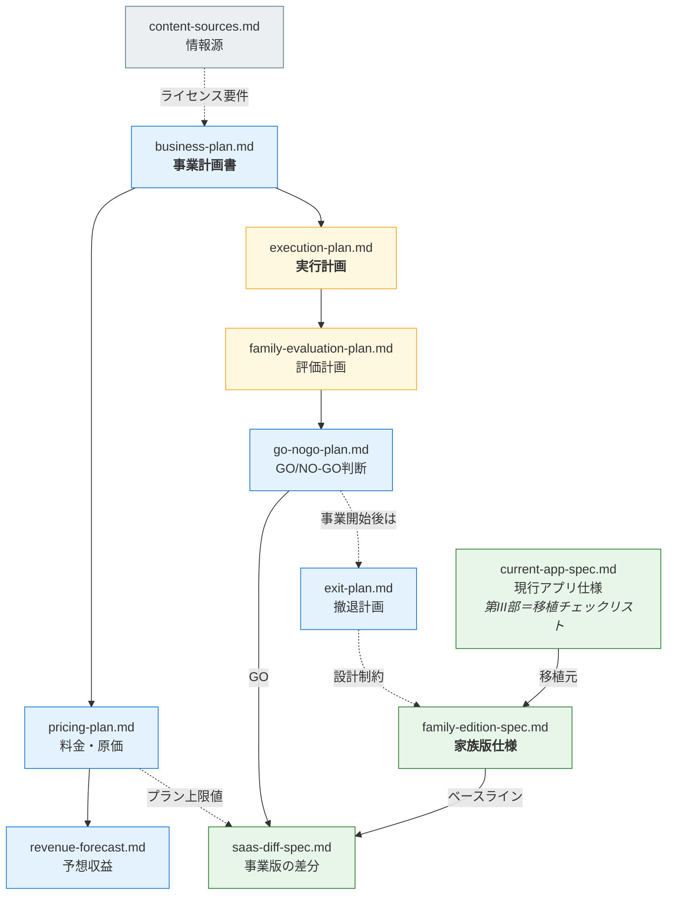

# ドキュメント地図

**目的から引く。** 迷ったらこの表から入る。

| 知りたいこと | 読むもの |
|---|---|
| 何を売る事業なのか | `00-business/business-plan.md` |
| いくらで、いくら儲かるのか | `00-business/pricing-plan.md` → `00-business/revenue-forecast.md` |
| 事業に進むかどうかの判断 | `00-business/go-nogo-plan.md` |
| 事業を始めた後、いつ畳むか | `00-business/exit-plan.md` |
| 今、現行アプリがどう動いているか | `10-specs/current-app-spec.md` |
| **今から何を作るのか** | `10-specs/family-edition-spec.md` ＋ `10-specs/current-app-spec.md` 第III部 |
| 事業版で何が増えるのか | `10-specs/saas-diff-spec.md` |
| どの順で進めるのか | `20-plans/execution-plan.md` |
| 家族版で何を測るのか | `20-plans/family-evaluation-plan.md` |
| 仕様と実装が合っているか | `40-tests/test-report.md`（結果）／`40-tests/test-spec.md`（何を試すか） |
| 情報源とライセンス | `30-research/content-sources.md`（**正典**） |
| なぜこの技術構成なのか | `30-research/saas-migration-study.md` |

---

## 構成

```
docs/
├── 00-business/     事業 — 何を売り、いくら儲かり、いつ判断するか
│   ├── business-plan.md          事業計画書（上位文書）
│   ├── pricing-plan.md           料金設計・原価・損益分岐
│   ├── revenue-forecast.md       予想収益書
│   ├── go-nogo-plan.md           事業版へのGO/NO-GO判断計画書
│   └── exit-plan.md              撤退計画（事業開始「後」の基準）
│
├── 10-specs/        仕様 — 何を作るか
│   ├── current-app-spec.md       現行アプリ（Mac常駐）の仕様 ※3部構成
│   │                               I. 概要とねらい
│   │                               II. 記事モード（Notion同期）
│   │                               III. 実装棚卸し＝移植チェックリスト
│   ├── family-edition-spec.md    ★家族版の仕様書（ベースライン）
│   └── saas-diff-spec.md         ★事業版の差分仕様書
│
├── 20-plans/        計画 — どう進めるか
│   ├── execution-plan.md         実行計画（Phase構成・現在地）
│   ├── family-evaluation-plan.md 家族版の評価計画書
│   └── status-summary.md         検討の現況整理（経緯のログ）
│
├── 30-research/     調査 — なぜそう判断したか
│   ├── content-sources.md        情報源の評価・ライセンス（正典）
│   └── saas-migration-study.md   技術選定の比較検討・法務・DB設計
│
└── 40-tests/        検証 — 仕様どおり動くか
    ├── test-spec.md              テスト仕様書（L1〜L3の自動＋L5手動）
    └── test-report.md            テスト結果報告書
```

実行コードは `tests/`（`python3 tests/run_all.py`）。

---

## 文書間の関係



**家族版仕様 ＋ 差分仕様 ＝ 事業版の完全な仕様。**

---

## 更新のルール

| 文書 | 更新のタイミング |
|---|---|
| `20-plans/status-summary.md` | 検討が進んだとき（経緯のログなので追記していく） |
| `20-plans/execution-plan.md` | Phaseが進んだとき（**現在地を必ず更新する**） |
| `30-research/content-sources.md` | 情報源を追加・変更したとき（**正典**。他文書の記述はこれに従う） |
| 仕様書 | 実装を変えたとき（**実装と仕様のズレを残さない**） |
