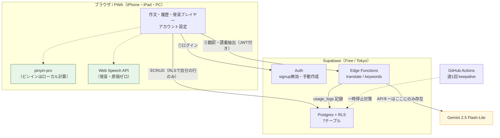
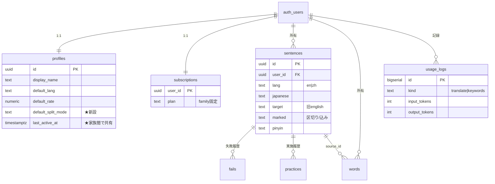
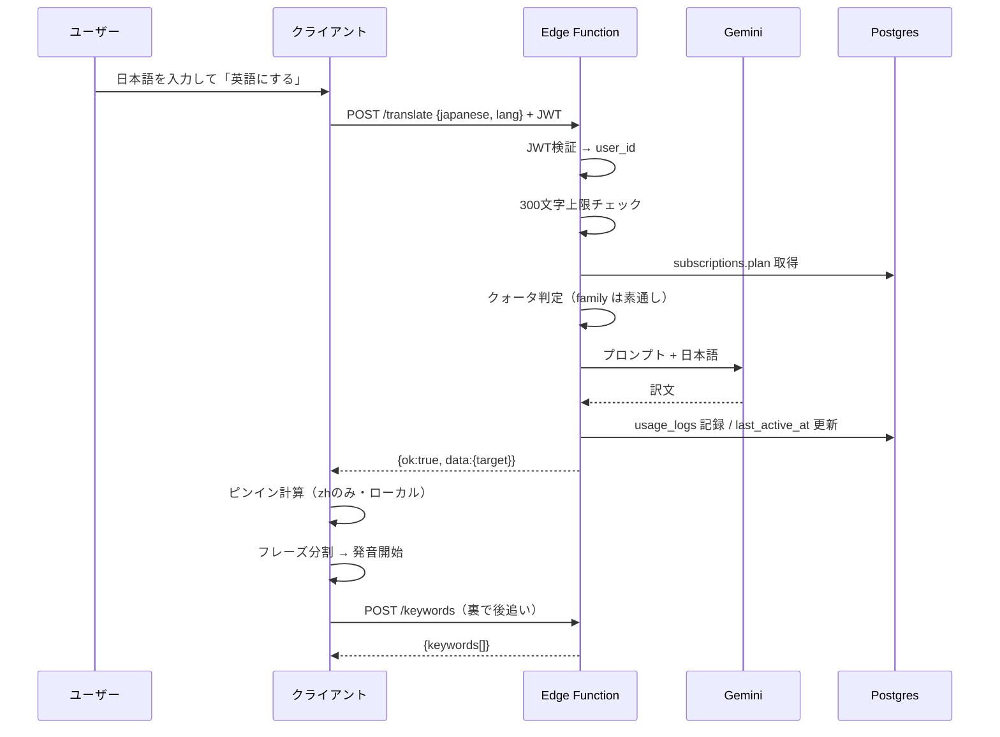
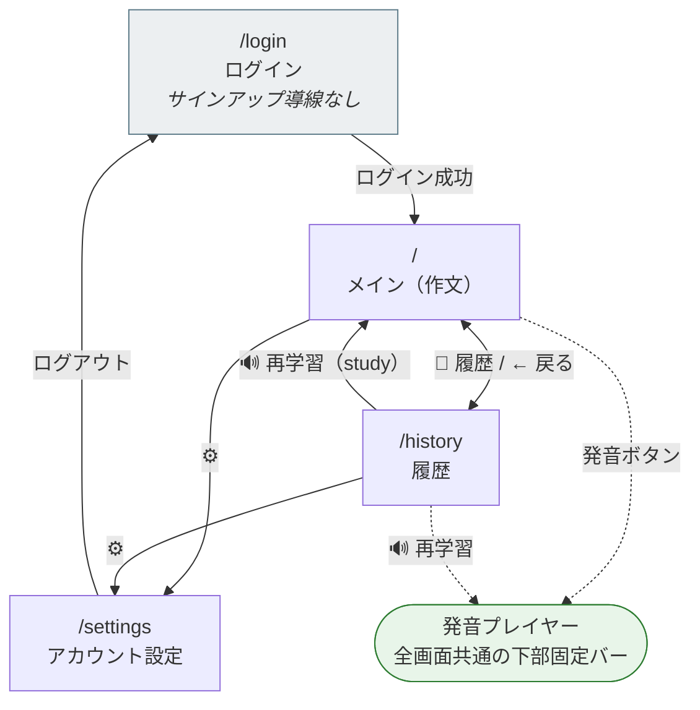
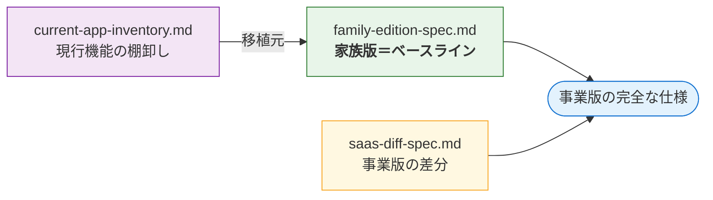

# [[家族版]]仕様書

作成日: 2026-07-26 / ステータス: 実装着手可
対象: Supabase + PWA のマルチユーザー版（**記事フィードと課金を含まない**）

> **本書だけで実装できることを目標とする。** 事業版の要素は意図的に除外している。
> 移植対象の機能一覧は `docs/current-app-inventory.md` を参照（本書と対で使う）。

---

## 0. 全体像

### 0.1 アーキテクチャ



**緑＝原価ゼロ（クライアント完結）**。発音とピンインをサーバーに出さないことが、この構成の費用優位の源泉。

### 0.2 データモデル（ER図）



現行のJSON配列（`fails[]` `practices[]`）を**行に正規化**するのが主な構造変更。

### 0.3 翻訳リクエストの流れ



**訳文が出た瞬間に発音が始まり、キーワード抽出は裏で走る**という現行の体感速度設計を維持する。

---

## 1. スコープ

### 含むもの

- Supabase Auth によるログイン（家族3人）
- Postgres + RLS による個人別のデータ分離
- 現行アプリの全機能の移植（`current-app-inventory.md` の判定に従う）
- クラウドLLM（Gemini）による翻訳・キーワード抽出
- データエクスポート
- PWA（manifestのみ）

### 含まないもの

記事フィード / Stripe課金 / 課金画面 / 利用規約・特商法表記・プライバシーポリシー / ソーシャルログイン / 弱点レポート

### 「用意だけする」もの（後付けが困難なため）

| 項目 | 家族版での状態 |
|---|---|
| `subscriptions` テーブル | 全員 `plan='family'` |
| `usage_logs` テーブル | 記録する（**実測データの取得が目的**） |
| クォータ判定のコードパス | 判定関数は書くが、`family` は上限なしで通す |

---

## 2. 確定した設計判断

質問ツールの不具合により、以下は**推奨案を採用した**。変更したい場合は該当箇所のみ修正すればよい。

| # | 判断 | 採用 | 理由 |
|---|---|---|---|
| 1 | 登録方式 | **サインアップ無効化** | 公開URLで第三者が登録するとLLM APIを消費される。実装も最小 |
| 2 | ピンイン | **クライアント側で処理** | `/pinyin` Edge Function が丸ごと不要になり、応答も速い |
| 3 | 家族間の可視性 | **最終利用日のみ共有** | 学習内容は見ない。撤退ライン④の判定に使える |
| 4 | PWA | **manifestのみ**（SWなし） | 半日で終わり、現行の使い勝手を維持できる |
| 5 | モデル選択UI | **廃止** | サーバー側で固定。ヘッダのステータス表示問題も同時に消える |

---

## 3. 利用者と認証

### 3.1 利用者

| ユーザー | 用途 |
|---|---|
| 本人 | 英語・中国語の学習、動作確認 |
| 娘 | 英語学習（**主たる想定ユーザー**） |
| （予備1名） | |

### 3.2 登録方式：サインアップ無効化

- **Supabase ダッシュボードの Authentication → Providers → Email で "Enable email signup" を OFF にする**
- アカウントは管理者（本人）が **Supabase ダッシュボードから手動作成**する
- **サインアップ画面は実装しない**

### 3.3 認証まわりの仕様

| 項目 | 仕様 |
|---|---|
| 方式 | メールアドレス + パスワード |
| メール確認 | **不要**（ダッシュボードで作成時に `email_confirm: true` を指定） |
| 娘のアカウント | 親のメールのエイリアス（`you+daughter@example.com`）で作成。子ども本人のメールアドレスは不要 |
| パスワードリセット | **画面を実装しない**。忘れたら親がダッシュボードで再設定する |
| セッション | Supabase SDK のデフォルト（localStorage に保持、自動リフレッシュ） |
| ログアウト | アカウント設定画面に配置 |
| 未認証時 | すべての画面から `/login` へリダイレクト |

> **メール送信を一切使わない構成**にしたため、Supabase 内蔵SMTPの送信制限を気にする必要がない。

---

## 4. 画面とURL設計

### 4.1 URL

現行のSPA構造（URL不変）を改め、**History API で3ルートを持つ**。PWAの起動先URLを固定するため。

| URL | 画面 | 認証 |
|---|---|---|
| `/login` | ログイン | 不要 |
| `/` | メイン（作文） | 必要 |
| `/history` | 履歴 | 必要 |
| `/settings` | アカウント設定 | 必要 |

プレイヤーは画面ではなく**全ルート共通の下部固定バー**（現行どおり）。

### 4.2 画面遷移



### 4.3 画面一覧

| 画面 | 内容 |
|---|---|
| **ログイン** | メール/パスワード入力、エラー表示のみ。サインアップ導線なし |
| **メイン** | 現行の `#viewMain` をそのまま移植（`current-app-inventory.md` §1.2, §1.3） |
| **履歴** | 現行の `#viewHistory` をそのまま移植（同 §1.4） |
| **プレイヤー** | 現行の `#player` をそのまま移植（同 §1.5） |
| **アカウント設定** | 表示名 / 既定言語 / 発音速度 / 区切りモード / **家族の最終利用日** / エクスポート / ログアウト |

### 4.4 ヘッダの変更

| 現行 | 家族版 |
|---|---|
| バージョン表示 | **削除** |
| Ollama✅ / 保存先 の2行 | **削除** → 代わりに**ログイン中の表示名**を表示 |
| 履歴トグル | 維持 |
| 再読込 | 維持 |
| — | **⚙（設定）を追加** |

---

## 5. データベース

### 5.1 スキーマ

```sql
-- ユーザープロフィール
create table profiles (
  id uuid primary key references auth.users on delete cascade,
  display_name text not null default '',
  default_lang text not null default 'en',          -- 'en' | 'zh'
  default_rate numeric not null default 0.9,        -- 0.4〜1.5
  default_split_mode text not null default 'fine',  -- 'normal'|'fine'|'sentence' ★新設
  last_active_at timestamptz,                       -- ★家族間で共有する唯一の情報
  created_at timestamptz not null default now()
);

-- 文（英語・中国語を lang 列で統合）
create table sentences (
  id uuid primary key default gen_random_uuid(),
  user_id uuid not null references auth.users on delete cascade,
  lang text not null default 'en',
  japanese text not null,
  target text not null,        -- 旧 english
  marked text,                 -- 区切り「/」込み。null なら target と同じ
  pinyin text,
  memo text not null default '',
  created_at timestamptz not null default now(),
  updated_at timestamptz not null default now()
);
create index on sentences (user_id, lang, created_at desc);

-- 単語帳
create table words (
  id uuid primary key default gen_random_uuid(),
  user_id uuid not null references auth.users on delete cascade,
  lang text not null default 'en',
  word text not null,
  meaning text not null default '',
  example text not null default '',
  pinyin text,
  source_id uuid references sentences on delete set null,
  created_at timestamptz not null default now()
);
create index on words (user_id, lang, created_at desc);

-- 失敗履歴
create table fails (
  id bigserial primary key,
  user_id uuid not null references auth.users on delete cascade,
  sentence_id uuid not null references sentences on delete cascade,
  label text not null default 'Fail',
  occurred_at timestamptz not null default now()
);
create index on fails (sentence_id);
create index on fails (user_id, occurred_at desc);

-- 実施履歴
create table practices (
  id bigserial primary key,
  user_id uuid not null references auth.users on delete cascade,
  sentence_id uuid not null references sentences on delete cascade,
  occurred_at timestamptz not null default now()
);
create index on practices (sentence_id);
create index on practices (user_id, occurred_at desc);

-- プラン（家族版では全員 'family'。事業版への布石）
create table subscriptions (
  user_id uuid primary key references auth.users on delete cascade,
  plan text not null default 'family',
  status text not null default 'active',
  updated_at timestamptz not null default now()
);

-- 使用量ログ（実測データの取得が目的）
create table usage_logs (
  id bigserial primary key,
  user_id uuid references auth.users on delete cascade,
  kind text not null,            -- 'translate' | 'keywords'
  model text not null,
  input_tokens int not null default 0,
  output_tokens int not null default 0,
  created_at timestamptz not null default now()
);
create index on usage_logs (user_id, created_at desc);
create index on usage_logs (kind, created_at desc);
```

### 5.2 RLSポリシー

**全テーブルで有効化する。2人でも例外なく。**

```sql
alter table profiles      enable row level security;
alter table sentences     enable row level security;
alter table words         enable row level security;
alter table fails         enable row level security;
alter table practices     enable row level security;
alter table subscriptions enable row level security;
alter table usage_logs    enable row level security;

-- 本人のみ全操作（sentences / words / fails / practices）
create policy "own rows" on sentences   for all using (auth.uid() = user_id) with check (auth.uid() = user_id);
create policy "own rows" on words       for all using (auth.uid() = user_id) with check (auth.uid() = user_id);
create policy "own rows" on fails       for all using (auth.uid() = user_id) with check (auth.uid() = user_id);
create policy "own rows" on practices   for all using (auth.uid() = user_id) with check (auth.uid() = user_id);

-- profiles: 自分の行は全操作。他人の行は「最終利用日と表示名だけ」読める
create policy "own profile"    on profiles for all    using (auth.uid() = id) with check (auth.uid() = id);
create policy "family read"    on profiles for select using (true);
--   ※ profiles には学習内容を入れないため、SELECT 全開放で問題ない。
--     他人に見えるのは display_name / last_active_at / 設定値のみ。

-- subscriptions / usage_logs: 本人が読むだけ。書き込みはサービスロール限定
create policy "own read" on subscriptions for select using (auth.uid() = user_id);
create policy "own read" on usage_logs    for select using (auth.uid() = user_id);
```

> **`usage_logs` への INSERT は Edge Function（サービスロール）からのみ**。クライアントに書かせない。

### 5.3 `last_active_at` の更新

翻訳リクエスト時と `practices` 記録時に、Edge Function または DBトリガーで `profiles.last_active_at = now()` を更新する。

---

## 6. Edge Function 契約

### 6.1 共通仕様

| 項目 | 仕様 |
|---|---|
| 認証 | `Authorization: Bearer <supabase_jwt>` 必須 |
| Content-Type | `application/json` |
| 成功レスポンス | `{"ok": true, "data": {...}}` （**現行エンベロープを踏襲**） |
| 失敗レスポンス | `{"ok": false, "error": "メッセージ"}` |
| タイムアウト | 30秒 |
| リトライ | クライアント側で1回のみ。サーバー側リトライはしない |

### 6.2 エラーコード

| コード | 意味 | クライアントの挙動 |
|---|---|---|
| 400 | 入力不正（必須項目欠落、langが不正） | エラーメッセージ表示 |
| 401 | JWT無効・期限切れ | `/login` へリダイレクト |
| 402 | クォータ超過 | **家族版では発生しない**（判定は通す） |
| 413 | 入力長超過（日本語300文字超） | 「入力が長すぎます」表示 |
| 429 | レート制限 | 「少し待ってから再試行してください」 |
| 502 | LLM API 障害 | 「翻訳サービスに接続できません」＋再試行ボタン |
| 504 | タイムアウト | 同上 |

### 6.3 `POST /functions/v1/translate`

**リクエスト**
```json
{ "japanese": "きょうは友だちと公園でサッカーをしてあそんだよ", "lang": "en" }
```

**レスポンス**
```json
{ "ok": true, "data": { "target": "I played soccer with my friend at the park today." } }
```

**処理**
1. JWT検証 → `user_id` 取得
2. `japanese` の長さ検証（**300文字上限**、超過なら413）
3. `subscriptions.plan` を取得 → クォータ判定関数を通す（`family` は無条件で通過）
4. `current-app-inventory.md` §8.1 のプロンプトで Gemini を呼ぶ（temperature 0.3）
5. 応答から前後の引用符を除去
6. `usage_logs` に `kind='translate'` で記録（input/output トークン数を含む）
7. `profiles.last_active_at` を更新

> **ピンインは返さない。** クライアント側で計算する（§7）。

### 6.4 `POST /functions/v1/keywords`

**リクエスト**
```json
{ "target": "I played soccer with my friend at the park today.",
  "japanese": "きょうは友だちと公園でサッカーをしてあそんだよ",
  "lang": "en" }
```

**レスポンス**
```json
{ "ok": true, "data": { "keywords": [ { "word": "played soccer", "meaning": "サッカーをして" } ] } }
```

**処理**
1〜3は translate と同じ。以降：
4. `current-app-inventory.md` §8.2 のプロンプトでJSON出力を要求
5. パース失敗時は `/\{.*\}/s` で抽出して再パース
6. **word/meaning 入替補正を適用**（`current-app-inventory.md` §7.1。移植必須）
7. 最大3件に切り詰め
8. `usage_logs` に `kind='keywords'` で記録

> **ピンインは返さない。** クライアント側で計算する。

### 6.5 使用モデル

| 用途 | モデル | 備考 |
|---|---|---|
| 翻訳 | `gemini-2.5-flash-lite` | 0.015円/文の試算根拠 |
| キーワード抽出 | `gemini-2.5-flash-lite` | 同上 |

**家族版の2ヶ月で実測し、`usage_logs` から原価を確定させる**（`saas-migration-plan.md` §8.0.2）。

---

## 7. クライアント実装方針

### 7.1 フレームワーク

**素のJavaScriptのまま。** 現行 `index.html` の構造を維持し、データアクセス層だけを差し替える。

- 理由：現行コードが動いており、フレームワーク導入は移植リスクを増やすだけ
- ルーティングのみ最小限の実装を追加（`history.pushState` + `popstate`）

### 7.2 データアクセス

| 現行 | 家族版 |
|---|---|
| `api("/api/sentences")` | `supabase.from('sentences').select(...)` |
| `api("/api/translate", {...})` | `supabase.functions.invoke('translate', {...})` |

**`api()` 関数のシグネチャを維持したまま中身を差し替える**のが最も安全。呼び出し側の変更を最小化できる。

### 7.3 全件ロードの維持

現行の「文200件・単語500件を毎回全取得してクライアント検索」を**そのまま維持する**。家族3人・数千件の規模では問題にならない。事業版で見直す。

### 7.4 ピンイン

- ライブラリ：`pinyin-pro`（CDNから読み込み）
- タイミング：訳文の編集時に**即時計算**（デバウンス不要）、プレイヤーの節チップ生成時にも即時
- **移行済みデータの `pinyin` は pypinyin 生成値をそのまま保持**する。新規生成分との表記差は許容する（声調記号付きで同形式のため実用上の差はほぼない）

### 7.5 設定値の同期

```
ログイン成功
  → profiles を取得
  → localStorage の targetLang / speechRate / splitMode を DB値で上書き
  → 以後、UI操作時は localStorage と profiles の両方を更新
```

**DBが正、localStorageはキャッシュ。**

### 7.6 オフライン・エラーハンドリング

**オフライン対応はしない。** 通信失敗時はエラーメッセージを表示するのみ（現行の `msg()` を流用）。キューイングや楽観更新は実装しない。

---

## 8. データ移行

### 8.1 対象

| 現行ファイル | 移行先 |
|---|---|
| `data/sentences.json` | `sentences` (lang='en') |
| `data/sentences_zh.json` | `sentences` (lang='zh') |
| `data/words.json` | `words` (lang='en') |
| `data/words_zh.json` | `words` (lang='zh') |

すべて**本人の `user_id`** を付与する。

### 8.2 変換規則

| 項目 | 規則 |
|---|---|
| `id` | hex32桁 → **ハイフンを挿入してuuid形式に**（`8-4-4-4-12`）。元のIDを保持することで `source_id` の解決が容易になる |
| `english` | → `target` に改名 |
| `created` | `"%Y-%m-%d %H:%M:%S"` のナイーブ時刻 → **JST（+09:00）として解釈**し timestamptz へ |
| `fails[]` | `fails` テーブルへ行展開（`label`, `occurred_at`） |
| `practices[]` | `practices` テーブルへ行展開（`occurred_at`） |
| `pinyin` | そのまま保持 |
| `memo` | 空文字なら `''` |
| `marked` | 空なら `target` と同値を入れる |

### 8.3 実行順序

1. `sentences`（en → zh）
2. `words`（`source_id` の外部キーが解決できるよう、sentences の後）

### 8.4 検証項目

| 項目 | 期待値 |
|---|---|
| `sentences` 件数 | 2ファイルのレコード数合計と一致 |
| `words` 件数 | 同上 |
| `fails` 件数 | **en側のみの合計**（`record_fail` のバグでzh側は空のはず。`current-app-inventory.md` §11.1） |
| `practices` 件数 | 全ファイルの `practices` 配列の長さ合計 |
| `words.source_id` | NULLでない行が、移行前の `source_id` 保有件数と一致 |
| ランダム10件 | 目視で日本語・訳文・区切り・日付を照合 |

### 8.5 冪等性

スクリプトは**冪等にする**（`on conflict (id) do nothing`）。失敗時は該当ユーザーの行を全削除してやり直す。

---

## 9. 環境変数

### 9.1 Edge Function（サーバー側・**絶対にクライアントへ出さない**）

| 変数 | 用途 |
|---|---|
| `GEMINI_API_KEY` | LLM API キー |
| `GEMINI_MODEL` | `gemini-2.5-flash-lite` |
| `SUPABASE_URL` | 自動注入 |
| `SUPABASE_SERVICE_ROLE_KEY` | `usage_logs` への書き込み用。自動注入 |
| `MAX_INPUT_CHARS` | `300` |

### 9.2 クライアント（公開されてよい）

| 変数 | 用途 |
|---|---|
| `SUPABASE_URL` | プロジェクトURL |
| `SUPABASE_ANON_KEY` | **RLSが効いている前提で公開可** |

### 9.3 `config.json` からの移行対応表

| 現行 | 移行先 |
|---|---|
| `storage.*` | **廃止** |
| `ollama.base_url` / `model` / `keep_alive` | **廃止** → `GEMINI_MODEL` |
| `server.host` / `port` | **廃止** |
| `fail_labels` | **クライアント側の定数へ**（`const FAIL_LABELS = ["Fail"]`） |

---

## 10. PWA

**manifest のみ。Service Worker は作らない。**

```json
{
  "name": "English Learning",
  "short_name": "英語学習",
  "start_url": "/",
  "display": "standalone",
  "background_color": "#ffffff",
  "theme_color": "#4a6cf7",
  "icons": [
    { "src": "/icon-192.png", "sizes": "192x192", "type": "image/png" },
    { "src": "/icon-512.png", "sizes": "512x512", "type": "image/png" }
  ]
}
```

- iOS用に `<meta name="apple-mobile-web-app-capable" content="yes">` も付与
- **オフライン動作はしない**（§7.6）

---

## 11. ホスティング

| 項目 | 内容 |
|---|---|
| 配信 | **Vercel Hobby**（無料。家族利用なので非商用制約に適合） |
| URL | `*.vercel.app` のまま。独自ドメインは事業版で取得 |
| Supabase | **Free プラン**、リージョン Tokyo |
| 一時停止対策 | **GitHub Actions で週1回 Supabase の REST API を叩く**（無料枠内） |

> **課金開始時には必ず Vercel Pro へ移行すること。** Hobby は非商用限定。

---

## 12. 実装チェックリスト

### 12.1 基盤

- [ ] Supabase プロジェクト作成（Tokyo / Free）
- [ ] Authentication → Email signup を **OFF**
- [ ] マイグレーションファイルで §5.1 のスキーマを投入
- [ ] §5.2 の RLS ポリシーを全テーブルに適用
- [ ] `auth.users` 作成時に `profiles` と `subscriptions` を自動作成するトリガー
- [ ] 家族3人のアカウントをダッシュボードで作成

### 12.2 Edge Function

- [ ] `translate`（§6.3）
- [ ] `keywords`（§6.4。**word/meaning入替補正を含む**）
- [ ] クォータ判定関数（`family` は通過）
- [ ] `usage_logs` への記録
- [ ] `last_active_at` の更新

### 12.3 クライアント

- [ ] ログイン画面
- [ ] ルーティング（`/` `/history` `/settings` `/login`）
- [ ] `api()` の中身を Supabase SDK に差し替え
- [ ] ヘッダの改修（バージョン・ステータス削除、表示名・⚙追加）
- [ ] モデル選択プルダウンの削除
- [ ] ピンインを `pinyin-pro` に差し替え
- [ ] 設定値の同期（§7.5）
- [ ] アカウント設定画面
- [ ] エクスポート機能（現行のMarkdown生成を移植）
- [ ] PWA manifest とアイコン
- [ ] **`current-app-inventory.md` の全32項目 + §7の12項目を「移植/廃止/変更」で埋める**

### 12.4 移行と確認

- [ ] 移行スクリプト作成（§8）
- [ ] ドライラン → 検証（§8.4）→ 本実行
- [ ] GitHub Actions の keepalive 設定
- [ ] **娘のアカウントで実機（iPhone/iPad）から動作確認**
- [ ] voice が存在するか実機で確認（`current-app-inventory.md` §5）

---

## 13. 受け入れ基準

1. `current-app-inventory.md` の全項目が「移植/廃止/変更」で埋まっている
2. 家族3人がそれぞれログインし、**互いのデータが見えない**（RLSの動作確認）
3. アカウント設定で**家族の最終利用日だけ**が見える
4. 既存データが全件移行され、§8.4 の検証項目を満たす
5. iPhone のホーム画面から起動し、発音・保存・履歴・再学習が動く
6. `usage_logs` にトークン数が記録されている
7. Edge Function の環境変数にAPIキーがあり、**クライアントのバンドルに含まれていない**

---

## 14. 事業版との関係

本書は**事業版のベースライン**でもある。事業版は本書に対する差分として `docs/saas-diff-spec.md` に記述されている。



**家族版 + 差分仕様書 = 事業版の完全な仕様**。

### 事業版で「削除」される家族版固有の要素

| 要素 | 理由 |
|---|---|
| `profiles` の `"family read"` RLSポリシー | **他人のプロフィールが見えてしまう。事業版では必ず削除**（`saas-diff-spec.md` §2.4） |
| アカウント設定の「家族の最終利用日」欄 | 同上 |
| GitHub Actions の keepalive | Pro では一時停止しないため不要 |

---

### 関連ドキュメント

- `docs/current-app-inventory.md` — **移植チェックリスト（本書と対で使う）**
- `docs/saas-diff-spec.md` — **事業版の差分仕様書（本書がベースライン）**
- `docs/status-summary.md` — 検討の現況整理
- `docs/saas-migration-plan.md` — 事業版の背景・意思決定・法務要件
- `docs/exit-plan.md` — 撤退ラインと退避先
